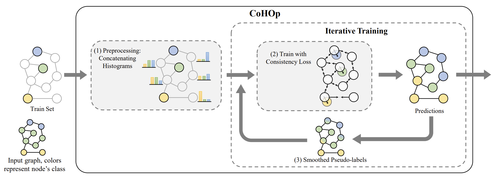

# CoHOp - Classifying Nodes in Graphs without GNNs
Official implementation for "Classifying Nodes in Graphs without GNNs" by Daniel Winter, Niv Cohen and Yedid Hoshen.



### Download Datasets
```shell
mkdir data
wget -P data https://github.com/BUPT-GAMMA/CPF/raw/master/data/npz/cora.npz
wget -P data https://github.com/BUPT-GAMMA/CPF/raw/master/data/npz/cora_full.npz
wget -P data https://github.com/BUPT-GAMMA/CPF/raw/master/data/npz/citeseer.npz
wget -P data https://github.com/BUPT-GAMMA/CPF/raw/master/data/npz/pubmed.npz
wget -O data/a-computer.npz https://github.com/BUPT-GAMMA/CPF/raw/master/data/npz/amazon_electronics_computers.npz
wget -O data/a-photo.npz https://github.com/BUPT-GAMMA/CPF/raw/master/data/npz/amazon_electronics_photo.npz
```

### Run Experiments
Transductive settings (semi-supervised):
```shell
 python main.py cora citeseer pubmed a-computer a-photo
```

Inductive settings:
```shell
 python main.py cora citeseer pubmed a-computer a-photo --unseen_rate 0.2
```

Supervised Transductive Settings:
```shell
 python main.py cora --train_labelrate=0.6 --val_labelrate=0.15
```